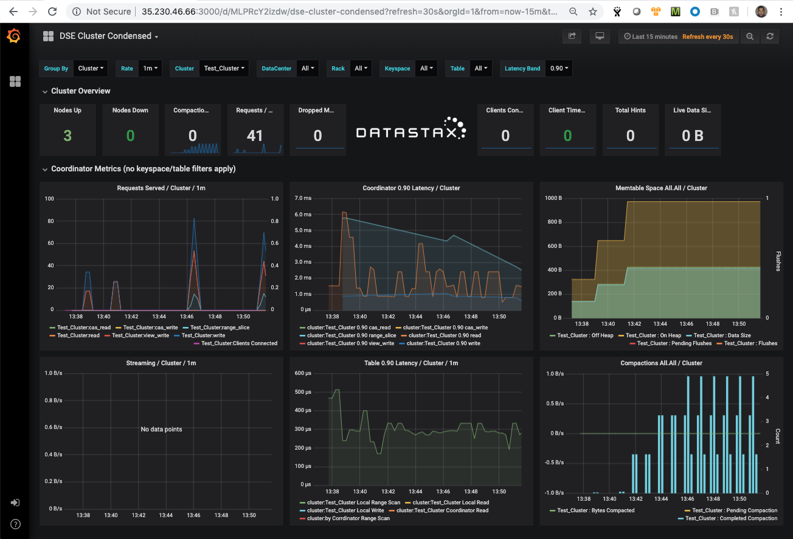

# kubernetes-dse-gke
Deploy DataStax Enterprise (DSE) cluster on a Kubernetes cluster (Local & GKE)

This project provides a set of example Kubernetes yamls to provision DataStax Enterprise in a Kubernetes cluster environment on your local machine or a GKE cluster for development use. It uses "default" namespace in Kubernetes and example cloud provider's storage class definition. You would modify the yamls according to your own deployment requirements such as namespace, storage device type, etc.

Additionally, this repo utilizes DSE Metrics Collector to aggregate and collect metrics. The DSE Metrics Collector exports the metrics to a Prometheus server where users can visualize these metrics through a Grafana server.

#### Prerequisites:
* Tools including wget, kubectl have already been installed on your machine to execute our yamls.
* Kubernetes server's version is 1.11.x or higher. 

#### 1. Create required configmaps for DataStax Enterprise Statefulset, Prometheus Statefulset, and Grafana Statefulset.
Docker images provided by DataStax include a startup script that swaps DataStax Enterprise (DSE) configuration files found in the /config volume directory with the configuration file in the default location on the container. In a Kubernetes deployment, it is enabled through Kubernetes ConfigMap volume to inject configuration data into Pods. 
In this repo, we provide a sample set of DSE configuration files.  Follow this link for supported configuration files for [DSE](https://github.com/datastax/docker-images/blob/master/server/6.0/files/overwritable-conf-files).  You could add additional supported configuration files which are not included in this repo. 
```
$ git clone https://github.com/DSPN/kubernetes-dse-gke

$ cd kubernetes-dse-gke

ConfigMaps for DSE:
$ kubectl create configmap dse-config \
--from-file=common/dse/conf-dir/resources/cassandra/conf \
--from-file=common/dse/conf-dir/resources/dse/conf

$ kubectl create configmap prometheus-conf-config \
--from-file=common/dse/conf-dir/resources/collectd

ConfigMap for Prometheus:
$ kubectl create configmap prometheus-config \
--from-file=common/metrics/prometheus

ConfigMap for Grafana:
$ kubectl create configmap grafana-provisioning-datasource-config \
--from-file=common/metrics/grafana/grafana-provisioning-datasources

$ kubectl create configmap grafana-provisioning-dashboards-config \
--from-file=common/metrics/grafana/grafana-provisioning-dashboards

$ kubectl create configmap grafana-dashboards-config \
--from-file=common/metrics/grafana/dashboards
```

#### 2. Choose one of the following deployment options.

##### 2.1 Running DSE locally on a laptop/notebook
*This yamls set uses emptyDir as DataStax Enterprise data store.*
```
$ kubectl apply -f local/dse-suite.yaml
```

##### 2.2 Running DSE on Google Kubernetes Engine (GKE) 
Follow the sample commands below to spin up a GKE cluster if you do not have one already. There are minimum cluster requirements that MUST be met for the deployment to succeed. Please ensure you have a GKE cluster meeting these minimums before deploying. The requirements are >=**7nodes of instance type n1-standard-4 with at least 60GB of disk size for each DSE node**.
Run the following command to create a similar GKE cluster:
```
$ gcloud container clusters create k8-12-5-10-gke-n1-std-4 \
--cluster-version=1.12.5-gke.10 --zone us-west1-b \
--machine-type n1-standard-4  --num-nodes 7
```
Run the following command to update a kubeconfig file with appropriate credentials and endpoint information to point kubectl at the GKE cluster created above:
```
$ gcloud container clusters get-credentials k8-12-5-10-gke-n1-std-4 --zone us-west1-b
```

*Now you are ready to deploy the yamls set for GKE which uses kubernetes.io/gce-pd provisioner along with pd-ssd persistent disk type*
```
$ kubectl apply -f gke/dse-suite.yaml
```

#### 3. Access the DataStax Enterprise cluster via cqlsh

3.1 You can run the following command to see if pods are running
```
$ kubectl get pods
```
3.2 You can run the following command to access through a DSE pod (dse-0)
```
$ kubectl exec -it dse-0 cqlsh
```
3.3 You can run the following command to access through a K8 load balacner
```
$ cqlsh `kubectl get svc dse-ext-lb -o jsonpath='{.status.loadBalancer.ingress[0].ip}'`
```

#### 4. Visualize DSE metrics through Grafana
```
Grab the Grafana server external IP:
$ grafana_ip=`kubectl get svc grafana-ext-lb \
-o jsonpath='{.status.loadBalancer.ingress[0].ip}'`

Access the Grafana dashboard via a browser using the output of the following command:
$ echo http://$grafana_ip:3000/dashboards
```


#### 5. Tear down the DSE deployment
```
$ kubectl delete -f <your cloud platform choice>/dse-suite.yaml (the same yaml file you used in step 2 above)
$ kubectl delete pvc -l app=dse (to remove the dynamically provisioned persistent volumes for DSE in step 2.2)
$ kubectl delete pvc -l app=prometheus (to remove the dynamically provisioned persistent volumes for Prometheus in step 2.2)
$ kubectl delete pvc -l app=grafana (to remove the dynamically provisioned persistent volumes for Grafana in step 2.2)
```

#### 6. (Optional) Delete the GKE cluster
If you have created a GKE cluster in step 2.2 above and you no longer need it, you can run a similar command like the following to remove the GKE cluster:
```
$ gcloud container clusters delete k8-12-5-10-gke-n1-std-4 --zone us-west1-b
```
